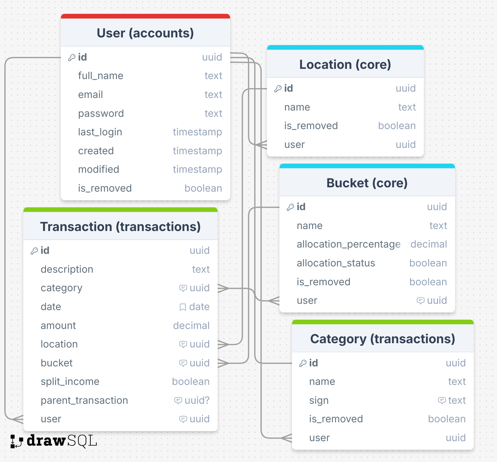

# Budget Management System

A comprehensive full-stack application for managing personal and family finances. Built with Django REST Framework backend and Streamlit frontend, this system offers robust expense tracking, income management, and budget analytics.

## System Architecture



Our system consists of three main components:

### Backend (Django + DRF)
- REST API Server
- PostgreSQL Database
- Redis Cache & Message Broker
- Celery Worker for async tasks

### Frontend (Streamlit)
- Interactive UI
- Real-time data visualization
- Direct API communication

### Infrastructure
- JWT Authentication flow
- Cache invalidation system
- Async task processing
- Data analytics pipeline

## Project Overview

This project demonstrates my expertise in:
- Building complex full-stack applications
- Implementing secure authentication systems
- Designing RESTful APIs
- Working with databases and caching
- Writing comprehensive tests
- Handling asynchronous tasks
- Creating interactive data visualizations
- Managing multiple deployment environments (local, test, production)

## Key Features

- **Multi-user Authentication**
  - Email-based authentication system
  - Secure JWT authentication
  - Complete user account management

- **Transaction Management**
  - Record income and expenses
  - Detailed transaction tracking
  - Precise transaction dating

- **Category Management**
  - Customizable categories
  - Transaction types (positive, negative, neutral)
  - Hierarchical category organization

- **Location-based Money Tracking**
  - Physical and virtual wallets
  - Balance tracking by location
  - Inter-wallet transfers

- **Financial Buckets System**
  - Percentage-based income allocation
  - Automatic distribution rules
  - Bucket-wise balance tracking

- **Advanced Analytics**
  - Monthly category analysis
  - Yearly profit/loss statements
  - Multi-year trend analysis
  - Real-time balance tracking
  - Financial bucket distribution
  - Historical reporting

## Technical Stack

- **Backend**
  - Django 5.1.4
  - Django REST Framework 3.15.2
  - PostgreSQL
  - Redis (caching, Celery)
  - Celery (async tasks)
  - JWT Authentication

- **Frontend**
  - Streamlit 1.41.1
  - Pandas
  - Interactive Charts

- **Testing & Quality**
  - pytest with pytest-django
  - Model Bakery for fixtures
  - Coverage reporting
  - Environment-specific configurations

## Project Structure

```
budget/
├── backend/
│   ├── budget/
│   │   ├── accounts/      # User management
│   │   ├── analytics/     # Financial analysis
│   │   ├── core/          # Core functionality
│   │   ├── transactions/  # Transaction handling
│   │   └── config/        # Project configuration
│   │       └── settings/  # Environment-specific settings
│   │           ├── base.py
│   │           ├── local.py
│   │           ├── test.py
│   │           └── production.py
│   └── requirements/      # Environment-specific dependencies
│       ├── base.txt
│       ├── local.txt
│       ├── test.txt
│       └── production.txt
└── frontend/
    └── streamlit/         # UI components
```

## Environment Setup

The project supports three distinct environments:

### Local Development
- Uses SQLite or local PostgreSQL
- Debug mode enabled
- Console email backend
- Local Redis instance
- Development-specific settings

### Testing Environment
- Uses SQLite database
- Disabled debug mode
- In-memory email backend
- Synchronous task execution
- Test-specific settings

### Production Environment
- PostgreSQL database
- Disabled debug mode
- SMTP email backend
- Redis for caching and Celery
- Enhanced security settings

## Local Development Setup

### Prerequisites

- Python 3.8+
- PostgreSQL
- Redis
- virtualenv

### Environment Configuration

1. Clone the repository:
```bash
git clone https://github.com/yourusername/budget.git
cd budget
```

2. Set up environment files:
```bash
cd backend/budget
cp config/env/.env.example config/env/.env.local
cp config/env/.env.example config/env/.env.test
cp config/env/.env.example config/env/.env.production
# Edit each .env file with appropriate settings
```

### Backend Setup

```bash
# Navigate to backend
cd backend

# Create and activate virtual environment
python -m venv venv
source venv/bin/activate  # Linux/Mac
# or
venv\Scripts\activate  # Windows

# Install dependencies for different environments
pip install -r requirements/local.txt    # for development
pip install -r requirements/test.txt     # for testing
pip install -r requirements/production.txt  # for production

# Apply migrations
python manage.py migrate

# Create development superuser
python manage.py createdefaultsuperuser

# Run server (choose environment)
python manage.py runserver --settings=config.settings.local
# or
python manage.py runserver --settings=config.settings.production
```

### Frontend Setup

```bash
# Open new terminal and navigate to frontend
cd frontend

# Create and activate virtual environment
python -m venv venv
source venv/bin/activate  # Linux/Mac
# or
venv\Scripts\activate  # Windows

# Install dependencies
pip install -r requirements.txt

# Run Streamlit
streamlit run app.py
```

### Services

Start Redis and Celery:
```bash
# Start Redis (ensure it's installed)
redis-server

# Start Celery worker (new terminal, choose environment)
cd backend
celery -A config worker -l info
```

## Testing

The project includes comprehensive test coverage (>92%) with:

```bash
# Run all tests (uses test settings automatically)
pytest

# Run tests with coverage report
pytest --cov=. --cov-report=term-missing

# Run specific test file
pytest path/to/test_file.py

# Run tests with specific markers
pytest -m "integration"
```

Our test suite includes:
- Unit tests for all models and business logic
- Integration tests for API endpoints
- Comprehensive fixture system using model-bakery
- Full coverage of authentication flows
- Extensive validation testing

## Environment-Specific Features

### Local Development
- Debug toolbar enabled
- Detailed error pages
- Local email console output
- Auto-reload on code changes
- CORS configured for local frontend

### Testing
- Fast password hasher
- In-memory caching
- Synchronous task execution
- SQLite database for speed
- Minimal external dependencies

### Production
- Secure SSL/HTTPS settings
- Production-grade email backend
- Redis caching
- PostgreSQL database
- CORS restrictions
- Enhanced security headers

## API Documentation

For detailed API documentation and examples, see [API Documentation](docs/api.md).

## Screenshots

[Include screenshots of key features here]

## Author

Elisei Profir
- GitHub: [Your GitHub]
- LinkedIn: [Your LinkedIn]
- Portfolio: [Your Portfolio]

## License

MIT License - see [LICENSE](LICENSE) file for details.
