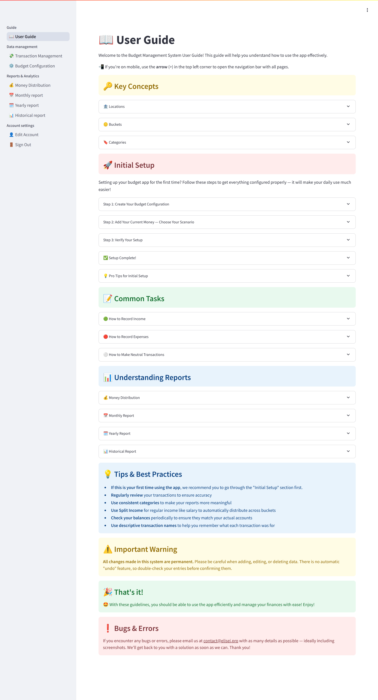
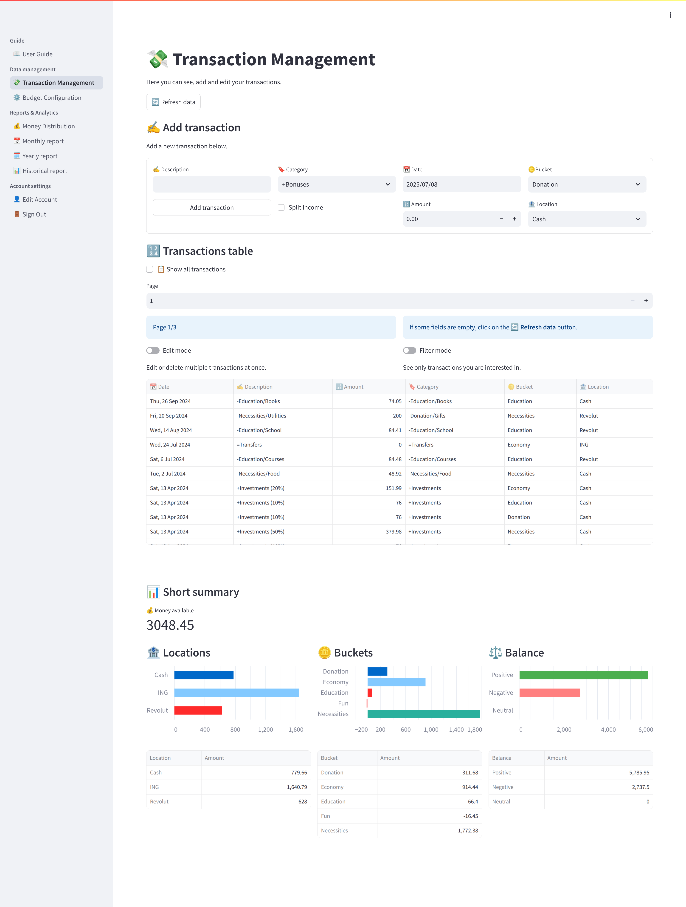
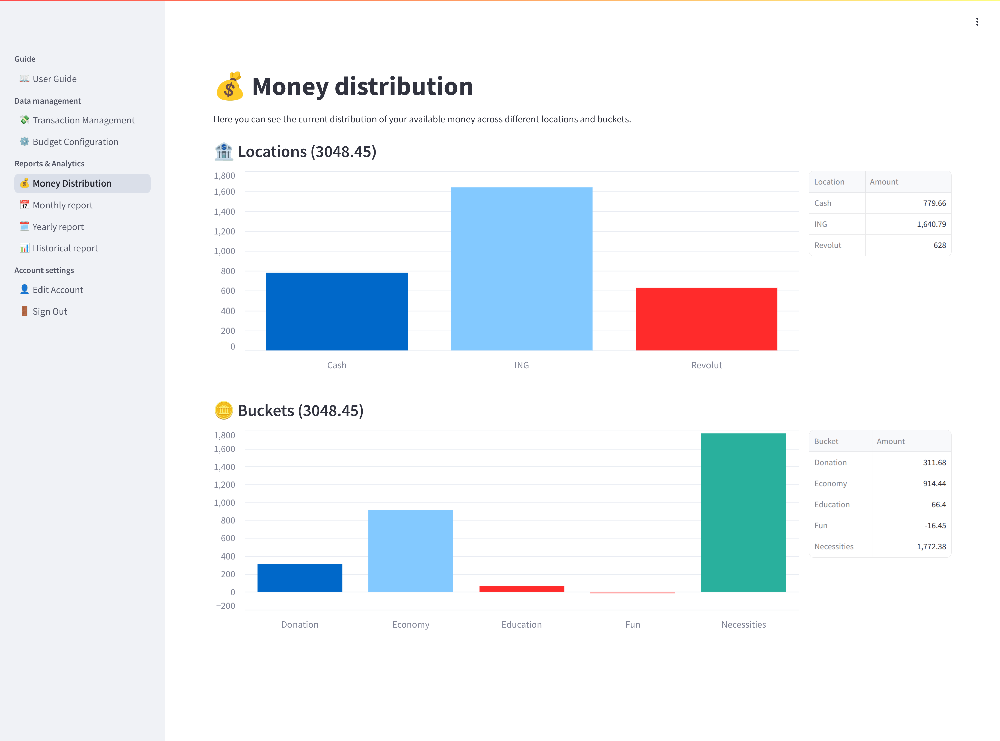
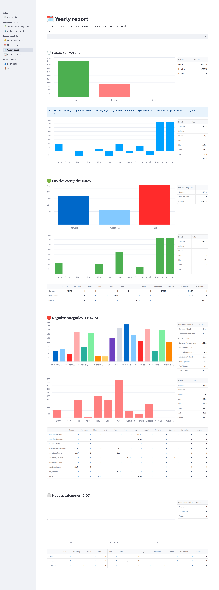

# Budget Management System

A comprehensive full-stack application for managing personal and family finances. The backend is built with Django REST Framework, while the frontend uses Streamlit for a fast, interactive experience. The project is fully containerized with Docker. It features JWT authentication, asynchronous task processing with Django Q, real-time balance analytics, and is deployed in production using Railway, Neon (PostgreSQL), and Upstash (Redis).

## ❓Why this kind of project?
I've always been passionate about financial education and personal finance management. Knowing exactly where my money comes from and where it goes has helped me make smarter financial decisions and use my resources more wisely.

This passion led me to create a fully customizable and user-friendly system for tracking both personal and family finances. I wanted a tool that provides clarity, structure, and insight—something that not only records transactions but helps make sense of them through intuitive organization and clear visualizations.

By building this comprehensive full-stack application, I aimed to turn financial awareness into a daily habit—empowering users (including myself) to manage money with confidence and long-term perspective.

### ✨ Main features
- 🏦 **Multi-location Tracking**: Record transactions across multiple locations
- 🪙 **Bucket System**: Organize your money into different financial purposes
- ✂️ **Income Splitting**: Automatically distribute income across multiple financial buckets
- 🔖 **Custom Categories**: Organize with customizable transaction categories
- ↔️ **Inter-wallet Transfers**: Move funds between different locations and buckets with neutral transactions
- 📊 **Comprehensive Analytics**: View monthly, yearly, and historical reports
- 📈 **Visual Insights**: Make informed decisions with data visualizations
- 📱 **Real-time Balance**: Track your current financial status across all locations and buckets

### 🔗 App links
- Backend / Django REST Framework: https://api.elisei.pro
- Frontend / Streamlit App: https://app.elisei.pro
- Project's GitHub Repository: https://github.com/eliseiprofir/budget

### 🧐 Demo acount
- Email: demo@demo.com
- Password: demo
- ❗Note: This account is created to demonstrate the application with random data, especially the reporting features. Please do not edit or delete any data. If you want to test the application's functionality, please create your own account. Thank you and enjoy! ❤️

### 📧 Contact
- Email: contact@elisei.pro
- GitHub Profile: https://github.com/eliseiprofir
- LinkedIn Profile: https://www.linkedin.com/in/eliseiprofir/

## System Architecture


Our system consists of three main components:

### Backend (Django + DRF)
- REST API Server
- PostgreSQL Database (Neon for production)
- Redis Cache (Upstash for production)
- Django Q for async task processing
- Multi-level caching system for analytics reports

### Frontend (Streamlit)
- Interactive UI
- Real-time data visualization
- Direct API communication
- Client-side caching to minimize API requests
- Automatic cache invalidation on data changes

### Infrastructure
- JWT Authentication flow
- Cache invalidation system
- Asynchronous task processing with Django Q
- Data analytics pipeline
- Docker containerization
- Railway deployment platform

## Project Overview

This project demonstrates my expertise in:
- Building complex backend applications (and frontend with Streamlit)
- Implementing secure authentication systems
- Designing RESTful APIs
- Working with databases and caching
- Writing comprehensive tests
- Handling asynchronous tasks with Django Q
- Creating interactive data visualizations
- Docker containerization and orchestration
- Cloud deployment and external service integration
- Managing multiple deployment environments (local, production)

## Key Features

- **Multi-user Authentication**
  - Email-based authentication system
  - Secure JWT authentication
  - Complete user account management

- **Location-based Money Tracking**
  - Physical and virtual wallets
  - Balance tracking by locations
  - Location-wise balance tracking

- **Financial Buckets System**
  - Percentage-based income allocation
  - Automatic distribution rules
  - Bucket-wise balance tracking

- **Category Management**
  - Customizable transaction categorization
  - Differentiated category types (positive, negative, neutral)
  - Category-wise balance tracking

- **Transaction Management**
  - Record positive (income), negative (expenses) and neutral (transfer) transactions
  - Detailed transaction tracking (amount, description, date, category, location, bucket)
  - Neutral transactions for transfers between locations and buckets, and temporary transactions like loans

- **Advanced Analytics**
  - Real-time balance tracking
  - Current money distribution across locations and buckets
  - Monthly reports - category analysis and profit/loss reports
  - Yearly report - category analysis and profit/loss reports broken down by months
  - Historical report - category analysis and profit/loss reports broken down by years

- **Performance Optimization**
  - Backend caching system with Redis
  - Asynchronous report generation with Django Q
  - Frontend caching to minimize API requests
  - Cache invalidation on data changes

## Technical Stack

- **Backend**
  - Django 5.1.4
  - Django REST Framework 3.15.2
  - PostgreSQL (Neon for production)
  - Redis (Upstash for production)
  - Django Q (async task processing)
  - JWT Authentication
  - Redis-based caching system

- **Frontend**
  - Streamlit 1.41.1
  - Pandas
  - Interactive Charts
  - Client-side caching system to minimize API requests

- **Infrastructure**
  - Docker & Docker Compose
  - Makefile for development workflow
  - Railway (production deployment)
  - Neon PostgreSQL (production database)
  - Upstash Redis (production cache)

- **Testing & Quality**
  - pytest with pytest-django
  - Model Bakery for fixtures (SQLite for tests)
  - Coverage reporting
  - Environment-specific configurations

## Project Structure

```
budget/
├── backend/
│   ├── budget/
│   │   ├── accounts/      # User management
│   │   ├── analytics/     # Financial analysis
│   │   ├── core/          # Core functionality
│   │   ├── transactions/  # Transaction handling
│   │   └── config/        # Project configuration
│   │       └── settings/  # Environment-specific settings
│   ├── requirements/      # Environment-specific dependencies
│   └── Dockerfile
├── frontend/              # Streamlit App / UI components
│   └── Dockerfile
├── docker-compose.yml        # Base services
├── docker-compose.local.yml  # Development overrides
├── docker-compose.prod.yml   # Production overrides
└── Makefile                  # Development commands
```

## Environment Setup

The project supports two main environments:

### Local Development
- Local PostgreSQL (Docker)
- Local Redis (Docker)
- Debug mode enabled
- Console email backend
- Development-specific settings

### Production Environment
- Neon PostgreSQL database
- Upstash Redis cache
- Disabled debug mode
- SMTP email backend
- Railway deployment
- Enhanced security settings

**Note**: Testing uses SQLite database via Model Bakery for faster test execution.

## Development Setup

### Prerequisites

- Docker
- Docker Compose
- Make (optional, for convenience commands)

### Quick Start

1. **Clone the repository:**
```bash
git clone https://github.com/eliseiprofir/budget.git
cd budget
```

2. **Set up environment files:**
```bash
# Copy example files and configure
cp .env.example.backend .env.local
cp .env.example.frontend frontend/.env.local
# Edit the files with your local settings
```

3. **Build and start the development environment:**
```bash
# Using Make (recommended)
make build
make up

# Or using Docker Compose directly
docker compose -f docker-compose.yml -f docker-compose.local.yml build
docker compose -f docker-compose.yml -f docker-compose.local.yml up
```

4. **Set up the database:**
```bash
# Run migrations
make migrate

# Create a superuser
make createdefaultsuperuser

# Optional: Seed with sample data
make seed
```

5. **Access the application:**
   - Backend API: http://localhost:8000/api
   - Frontend UI: http://localhost:8501
   - PostgreSQL: localhost:5432
   - Redis: localhost:6379

## Available Make Commands

### Development
- `make build` - Build containers for development
- `make up` - Start development environment
- `make up-d` - Start development environment in detached mode
- `make down` - Stop development environment
- `make down-v` - Stop development environment and remove volumes

### Database Management
- `make makemigrations` - Create new migrations
- `make migrate` - Apply migrations
- `make migrations` - Create and apply migrations
- `make createsuperuser` - Create a superuser
- `make createdefaultsuperuser` - Create default superuser
- `make seed` - Seed database with random data
- `make clear` - Clear database except for superusers

### Django Q Management
- `make qcluster` - Start Django-Q cluster
- `make qmonitor` - Monitor Django-Q cluster
- `make qinfo` - Show Django-Q info
- `make qhealth` - Check Django-Q health

### Code Quality
- `make lint` - Run ruff linter
- `make lint-fix` - Fix linting issues automatically
- `make format` - Format code using ruff

### Testing
- `make test` - Run tests

### Production
- `make build-prod` - Build containers for production
- `make up-prod` - Start production environment
- `make down-prod` - Stop production environment

### Utilities
- `make logs` - View logs from all containers
- `make help` - Display all available commands

## Production Deployment

The application is deployed on Railway with the following architecture:

### Services
- **Backend Service**: Django API server with Gunicorn
- **Frontend Service**: Streamlit application
- **Django Q Cluster**: Async task processing

### External Services
- **Database**: Neon PostgreSQL
- **Cache**: Upstash Redis

### Environment Variables

Configure the following environment variables in your deployment platform:

**Backend (.env.example.backend):**
```env
SECRET_KEY=your_secret_key_here
DEBUG=False
DJANGO_ALLOWED_HOSTS=your-domain.com
DJANGO_CSRF_TRUSTED_ORIGINS=https://your-domain.com
DJANGO_SETTINGS_MODULE=config.settings.production
DB_HOST=your-neon-host
DB_NAME=your-db-name
DB_USER=your-db-user
DB_PASSWORD=your-db-password
DB_PORT=5432
REDIS_URL=your-upstash-redis-url
CORS_ALLOWED_ORIGINS=https://your-frontend-domain.com
```

**Frontend (.env.example.frontend):**
```env
ENVIRONMENT=production
BACKEND_URL=https://your-backend-domain.com/api
```

## Testing

The project includes comprehensive test coverage (>92%) with:

```bash
# Run all tests
make test

# Or with Docker Compose directly
docker compose -f docker-compose.yml -f docker-compose.local.yml run --rm backend python -m pytest budget/
```

Our test suite (151 tests) includes:
- Unit tests for all models and business logic
- Integration tests for API endpoints
- Comprehensive fixture system using Model Bakery
- Full coverage of authentication flows
- Extensive validation testing
- SQLite database for fast test execution

## Container Architecture

### Backend Container
- Python 3.10 slim base image
- Environment-specific dependency installation
- Django Q worker support
- Gunicorn for production serving

### Frontend Container
- Python 3.10 slim base image
- Streamlit application
- Environment-aware configuration

### Database Container
- PostgreSQL 16
- Health check configuration
- Persistent volume storage

### Redis Container
- Redis 6
- Persistent volume storage
- Used for Django Q message queue

## API Documentation

For detailed API documentation and examples, see [API Documentation](docs/api.md).

## Screenshots

Here are some screenshots showcasing the main features of the application:

### User Guide


### Transaction Management


### Money Distribution


### Yearly Analytics


*For more screenshots, please check the [docs/screenshots](docs/screenshots/) folder.*

## Author

Elisei Profir
- GitHub: https://github.com/eliseiprofir
- LinkedIn: https://www.linkedin.com/in/eliseiprofir/

## License

MIT License - see [LICENSE](LICENSE) file for details.
